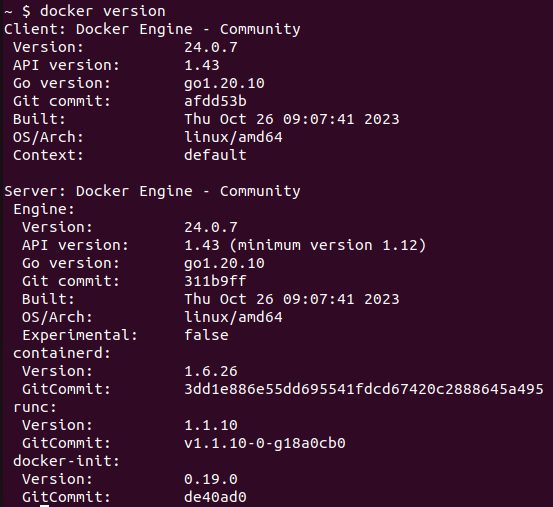
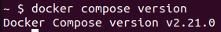
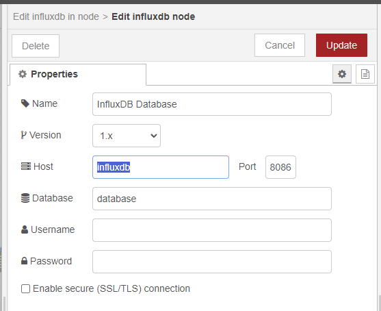
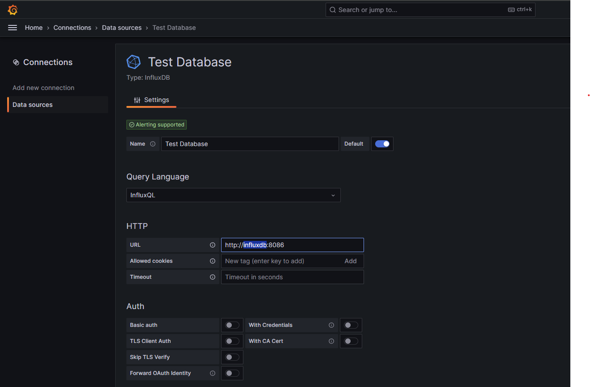

# Install Node-RED, InfluxdB and Grafana with Docker

"*Docker is an open platform for developing, shipping, and running applications. Docker enables you to separate your applications from your infrastructure so you can deliver software quickly.*"

## Requirements

- Docker
- Docker Compose

These tools are included in the [Docker Engine](https://docs.docker.com/engine/).

(*If you has docker & docker compose installed on your server, you can skip to Step 9*)

---

For **Ubuntu 22.04**, follow one-by-one commands listed below to install the Docker Engine:

- Step 1: Update your existing list of packages
```
sudo apt update
```

- Step 2: Install a few prerequisite packages which let ```apt``` use packages over HTTPS
```
sudo apt install -y apt-transport-https ca-certificates curl software-properties-common
```

- Step 3: Then add the GPG key for the official Docker repository to your system
```
curl -fsSL https://download.docker.com/linux/ubuntu/gpg | sudo gpg --dearmor -o /usr/share/keyrings/docker-archive-keyring.gpg
```

- Step 4: Add the Docker repository to APT sources
```
echo "deb [arch=$(dpkg --print-architecture) signed-by=/usr/share/keyrings/docker-archive-keyring.gpg] https://download.docker.com/linux/ubuntu $(lsb_release -cs) stable" | sudo tee /etc/apt/sources.list.d/docker.list > /dev/null
```

- Step 5: Update the list of packages
```
sudo apt update
```

- Step 6: Install the Docker Engine
```
sudo apt install -y docker-ce
```

- Step 7 (Optional): Add current user to docker group to run docker commands without ```sudo```
```
sudo usermod -aG docker ${USER}
```

- Step 8:
Log out of the server and back in to apply the new installation & policy. (Reboot if needed)

- Step 9: To check if your installation is correct, you can check the version that available on your system by following commands.

```
docker version
```



```
docker compose version
```



---

**For other systems**, refer to this guide instead: [Install Docker Engine](https://docs.docker.com/engine/install/)

---

**Tip**: If you are testing on a system with GUI, docker-desktop can provide same tools with extra GUI management applications: https://www.docker.com/products/docker-desktop/

## Installation of Node-RED, InfluxdB and Grafana stack

### Step 1. Create folder
```
mkdir ~/influxdb_nodered_grafana
```

### Step 1. Download docker-compose.yml file

```
cd ~/influxdb_nodered_grafana && \
wget https://fabienferrero.github.io/docker_nodered_grafana_influxdb/docker-compose.yml
```

### Step 3: Deploy the docker-compose.yml file

```
docker compose up -d
```

### Step 4: Check the results

- For Node-RED:
```
http://<your server address>:1880
```
- For Grafana: default `username` / `password` are `admin` / `admin`
```
http://<your server address>:3000
```

## Notice for Networking

Docker containers in this installation are connected via an internal network and has different internal IP addresses. Therefore, instead of the ```localhost```, accessing to other containers should be done with the **container's name** (*which will be resolved to the internal IP address*). Below are a few example:

#### For Node-RED



#### For Grafana



---

GLHF!
